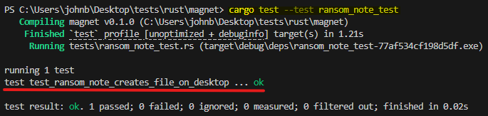

# Magnet  

[](http://unlicense.org/)    

  


> Draw the Signals, Detect the Threats.  


## Abstract  


**Magnet** is Purple-team telemetry & simulation toolkit.  
**Purpose:** modular, cross-platform (eventually) generator for benign telemetry and purple-team exercises.  
Why the name?  
Because this attracts SOC analysts and detection rules! 😜  
As a secondary use case, Magnet can also be used as a decoy during red team engagements, in order to generate false positives noise and distract defenders. 
From an architectural standpoint, Magnet is modular, allowing you to create as many modules as you like and modify existing ones without necessarily affecting the others.  


> [!CAUTION]  
> Magnet prioritizes non-intrusive modules that only aim to simulate suspicious or malicious activity but some of the modules may still be detected by EDRs:    
> **TEST ONLY ON AUTHORIZED SYSTEMS**.  
> The tool is best suited for on-the-fly demonstration/detection testing and does not replace fully fledged purple-team exercises conducted by experienced red teamers.    
>  
> The project is still in its early stages of development and may contain bugs: contributions are very welcome!


## Quickstart

Compile:

For Windows: 
```bash
cargo build --target x86_64-pc-windows-msvc --release
```  


For Linux: 
```bash
cargo build --target x86_64-unknown-linux-gnu --release
```  

Each binary only includes the modules for that platform.


list modules
```bash
magnet list
``` 

Run all windows modules:  
```bash
magnet run windows all
```   

Run some of the windows modules:  
```bash
magnet run windows discovery_sim ransomware_sim high_cou_miner_sim
```  

## activity logs  
For each execution, Magnet writes detailed activity logs (in various formats) to
`%USERPROFILE%\Documents\MagnetTelemetry`.  
Activity artifacts may also be created in that directory or in other locations, depending on the module:  
for example, in the ransomware simulation, the encrypted files are stored in the `MagnetTelemetry` folder, while the ransom note is placed on the user's `Desktop`.    

## tests  
Some modules already implement unit testing, for example:  
```bash
cargo test --test ransom_note_test
```  

  


## Video Demo  

https://github.com/user-attachments/assets/3d9aa7a9-6a22-4e4b-86cd-f1761756b241


## To-Do

- [ ] Add other windows modules
- [ ] Add linux modules
